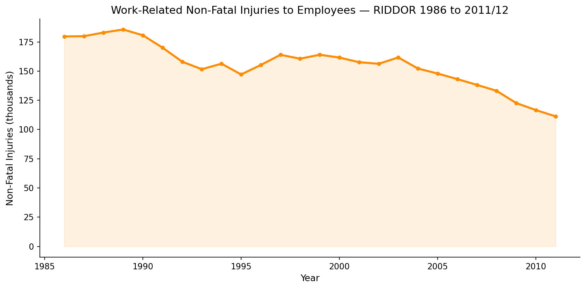
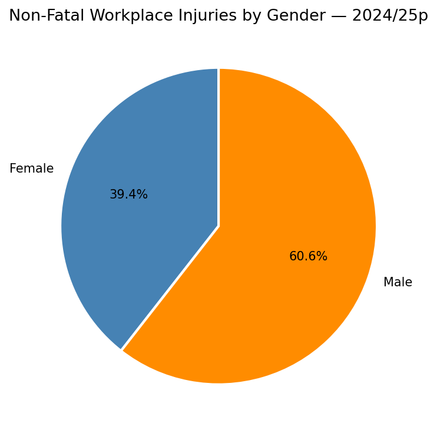

# RIDDOR Workplace Injury Analysis — HSE Great Britain

**Author:** Zeel Vaghela  
**Education:** MSc Bioinformatics (Distinction), Teesside University, UK  
**Certification:** NEBOSH National General Certificate (in progress)  
**Current Role:** ICQA Analyst, Amazon Fulfilment Centre, Hull, UK  
**Data:** Health and Safety Executive (HSE), UK Government Official Statistics  
**Tools:** Python 3, Google Colab  

---

## Background

Under RIDDOR 2013, employers in Great Britain are legally required to report
work-related deaths, specified injuries, over-seven-day injuries, occupational
diseases, and dangerous occurrences to the Health and Safety Executive. The HSE
publishes this data annually as official statistics, making it one of the most
reliable sources for tracking workplace safety trends across industries.

This project uses two official HSE datasets to examine how workplace injury
patterns have changed since 1986, which industry sectors carry the highest
current injury burden, and how injuries are distributed across age groups
and gender in the most recent reporting year.

---

## Data

Both datasets were downloaded from the HSE statistics tables index at
https://www.hse.gov.uk/statistics/tables/index.htm

RIDHIST covers fatal and non-fatal injuries reported in Great Britain from
1974 to 2024/25, updated November 2025. RIDAGEGEN covers injuries broken
down by age, gender, and broad industry group from 2014/15 to 2024/25.

---

## Results

### Figure 1 — Fatal Injuries 1986 to 2024/25

Fatal workplace injuries have fallen from 357 in 1986 to 75 in 2024/25,
a reduction of 79% over 39 years. The sharp spike in 1988 corresponds to
the Piper Alpha oil platform disaster, which killed 167 workers in a single
incident and remains the deadliest industrial accident in UK history. Since
2008 the figures have remained consistently below the long-term average of
181 per year, suggesting that regulatory and enforcement improvements have
produced lasting structural change rather than short-term fluctuation.

---

### Figure 2 — Non-Fatal Injuries 1986 to 2011/12

Non-fatal injuries to employees started at 179,000 in 1986 and declined
to 111,000 by 2011/12. The rate of decline was faster in the early 1990s
and slowed through the late 1990s and 2000s before accelerating again
from 2007 onwards. Non-fatal injury reduction is generally slower than
fatal injury reduction because it covers a much wider range of incident
types across millions of workplaces, and many lower-severity injuries
remain unreported even under mandatory reporting obligations.

---

### Figure 3 — Fatal vs Non-Fatal Combined

Plotting both series together over the overlapping period confirms that
the downward trend is consistent across severity categories. The steepest
combined falls occurred between 1988 and 1995, likely driven by the
legislative changes following the Piper Alpha inquiry and the introduction
of the Management of Health and Safety at Work Regulations 1992.

---

### Figure 4 — Injuries by Industry Sector 2024/25

Health and social work reports the highest number of non-fatal injuries
at 11,157, followed by manufacturing at 8,853 and transportation and
storage at 7,698. The health and social work figure is driven primarily
by manual handling injuries from patient lifting and repositioning, slip
and trip incidents in clinical environments, and workplace violence from
patients. Manufacturing and transport injuries reflect machinery operation
risks and vehicle movements. These three sectors together account for
the majority of the total RIDDOR reported injury burden and represent
the most important targets for sector-specific HSE intervention.

---

### Figure 5 — Injuries by Age Group 2024/25

The 45 to 54 age group has the highest absolute injury count at 21.1%,
closely followed by 35 to 44 at 20.3% and 25 to 34 at 19.5%. These
three groups together account for just over 60% of all reported injuries.
This distribution largely reflects workforce participation rates rather
than elevated individual risk. Younger workers in the 16 to 24 range
have lower absolute counts but typically carry higher injury rates per
worker because they are more likely to be in physically demanding entry
level roles without the experience and site-specific training of older
colleagues.

---

### Figure 6 — Injuries by Gender 2024/25

Male workers account for 60.6% of reported non-fatal injuries and female
workers 39.4%. This split is not primarily a behavioural difference but
a reflection of where men and women are concentrated in the workforce.
Construction, manufacturing, and transport — the three sectors with the
highest physical injury risk per worker — are predominantly male. As
workforce composition in these sectors changes over time, the gender
split in injury data would be expected to shift accordingly.

---

## Key Findings

Fatal workplace injuries in Great Britain have fallen by 79% since 1986,
one of the largest sustained reductions in occupational safety outcomes
in the modern regulatory era. Non-fatal injuries declined by 38% over
the same period though the rate of improvement has slowed since the
early 2010s, suggesting that the remaining injury burden is concentrated
in harder to address areas.

Health and social work, manufacturing, and transportation account for
the highest injury volumes in the current reporting year and should be
the focus of targeted risk assessment and intervention resources. Workers
aged 35 to 54 carry the highest absolute injury burden. Gender differences
in injury counts reflect sector composition rather than individual
behaviour.

---

## Limitations

Long-term non-fatal trend data from RIDHIST ends at 2011/12 due to
a change in HSE reporting methodology. The demographic breakdown in
figures 4, 5, and 6 uses the RIDAGEGEN dataset which covers 2014/15
to 2024/25p. The p notation on the latest year indicates provisional
figures subject to revision.

---

## Data Source

Health and Safety Executive — RIDDOR Statistics  
https://www.hse.gov.uk/statistics/tables/index.htm  
Crown copyright, used under Open Government Licence v3.0

---

Zeel Vaghela  
zjvaghela01@gmail.com  
https://www.linkedin.com/in/zeel-vaghela  
Hull, United Kingdom
